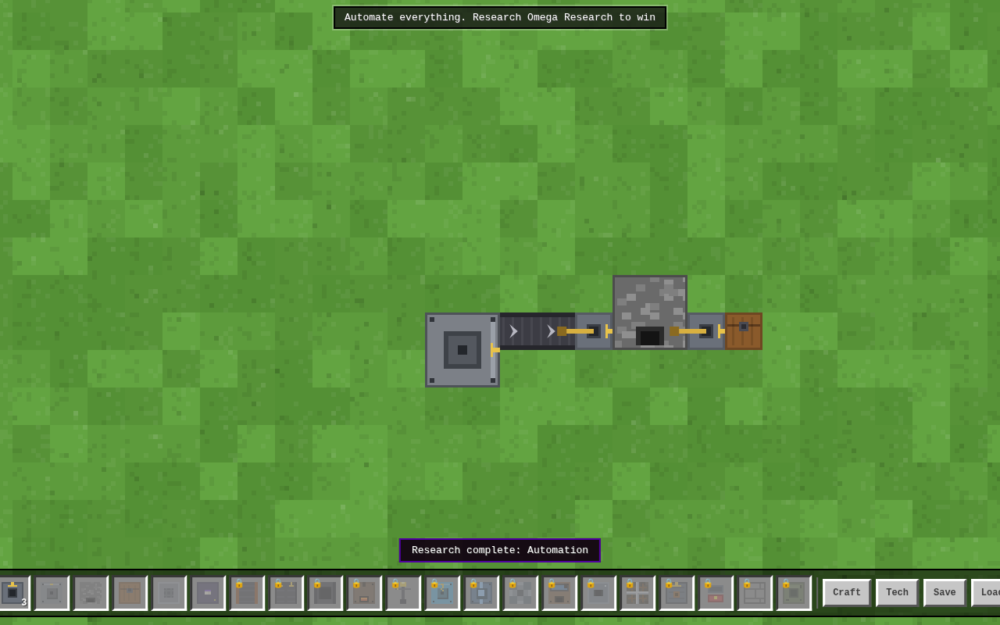

# BlockForge

A browser-based **factory automation game** with a blocky, pixel-art vibe — inspired by
the mechanics of Factorio and the look-and-feel of voxel sandbox games. Built from
scratch in vanilla JavaScript + Canvas: no frameworks, no build step, no assets on disk
(every sprite is procedurally drawn in code).



> **Note on IP:** this is an original homage. Game *mechanics* (belts, drills, research)
> are not copyrightable, but art, names, and content are — so everything here (code,
> pixel art, item/tech names) is original work. No assets from Factorio, Minecraft, or
> any other game are used.

## Play

No install needed:

```sh
# open directly…
open index.html            # macOS
xdg-open index.html        # Linux

# …or serve it (recommended)
python3 -m http.server 8000
# then visit http://localhost:8000
```

## The game

You're dropped into a procedurally generated world with patches of **iron, copper,
coal, and stone**. Mine by hand, then automate:

1. **Hold left-click** on an ore patch to mine by hand.
2. Place an **Auto-Drill** on ore and fuel it with coal.
3. Route ore with **Conveyors**; move items in/out of machines with **Grabber Arms**
   (they pick up behind, drop in front).
4. Smelt ore into **ingots** in a **Furnace**, craft **gears → wire → circuits**.
5. Craft **Basic Tomes**, feed them into a **Study Table**, and research technologies:
   the **Crafter** (automated crafting), **Fast Conveyors**, **Advanced Tomes**,
   drill/crafter speed boosts…
6. Research **Plumbing** to unlock **Pumps** (place on the shore next to a lake),
   **Pipes** (form single-fluid networks), and **Boilers** (coal + water → steam).
   Research **Steelworks** to unlock the **Steel Forge**, which turns steam + iron
   ingots + coal into **Steel Ingots**.
7. Research **Railways** to unlock **Rail Track**, **Rail Depots** (named, renameable
   stops with a small buffer), and **Hauler Trains** — 2-car units that BFS-pathfind
   along your track and shuttle cargo between two depots, burning coal as they go.
8. Finish **Omega Research** to win. Then keep going — the forge must grow.

### Controls

| Input | Action |
|---|---|
| WASD / arrows / middle-drag | Pan camera |
| Mouse wheel | Zoom |
| 1–9 / hotbar click | Select building |
| R | Rotate before placing |
| Left-click / drag | Place (drag lays conveyor lines) · mine ore · open machine |
| Right-click | Cancel selection / remove machine (refunds it + contents) |
| Q | Clear selection |
| E / T / H | Crafting · Research · Help panels |
| Esc | Close panels / cancel |

Progress autosaves to `localStorage` every minute (plus manual Save/Load buttons).

## What's simulated

- **Conveyors** with per-item positions, spacing/compression, belt-to-belt transfer,
  and speed tiers — each belt carries **two independent lanes** (left/right) that keep
  their lane across transfers, with side-loads landing on the near lane
- **Belt Splitters**, which pull from belts behind them and alternate their output
  round-robin between the two belts ahead, preserving each item's lane
- **Tunnel Belts**, placed in entrance/exit pairs (up to 4 tiles apart) that carry
  items underground with a transit delay based on distance, so belts can cross
- **Grabber arms** with animated swings that move items between belts and machines
- **Fueled machines** — drills and furnaces burn coal (energy buffered per item)
- **Ore depletion** — every tile has a finite richness that drains and empties
- **Crafters** with selectable recipes, input/output buffers, and ingredient limits
- **Research** — study tables consume tomes to progress a shared tech tree that
  unlocks recipes, buildings, and speed multipliers
- **Electricity** — Coal Generators feed Power Pylon networks (grouped by proximity each tick);
  Volt Drills draw power instead of fuel and slow down proportionally when the grid is undersupplied
- **Pollution & defense** — working drills/furnaces emit pollution on a coarse grid
  that diffuses and decays; distant creature dens spawn hostile **smoglings** when
  nearby pollution runs high enough. They path toward your machines and attack
  anything they bump into. Research **Fortification** to build **Walls** and
  **Bolt Turrets** (fed with **Bolts**) for defense, and repair damaged machines
  from their entity panel. A **Peaceful mode** toggle (Help panel) disables spawns.
- **Hand crafting** with a queue, plus a guided hint line for new players
- **Fluids** — seeded lakes block building except for the shore-placed Pump; Pipes
  form connected networks that carry one fluid at a time (capacity-limited, mixing
  blocked); Boilers burn coal to convert water into steam in a separate network; a
  Steel Forge consumes steam plus iron ingots and coal to produce Steel Ingots
- **Trains** — rails form an implicit graph (adjacent rail tiles connect); Hauler
  Trains BFS-pathfind to a chosen depot, load/unload a configurable cargo swap, burn
  coal while moving, and wait with a visible status if their track is broken

## Code layout

| File | Purpose |
|---|---|
| `js/data.js` | Items, recipes, tech tree, entity definitions, tuning constants |
| `js/world.js` | Seeded world generation (ore blobs), tile state, mining |
| `js/sim.js` | The simulation: belts, machines, research, inventory, save/load |
| `js/render.js` | Canvas renderer + all procedural pixel-art sprites/icons |
| `js/ui.js` | Input, hotbar, panels, tooltips, hints |
| `js/main.js` | Bootstrap and the fixed-timestep game loop (30 UPS) |

## Roadmap ideas

Enemies/defense, blueprints, a minimap, rail signals/junctions, and modded
recipes are all natural next steps.
Power grids, fluids & pipes, trains, ranged/flying creatures, blueprints, a minimap,
two-lane belts, splitters, and modded recipes are all natural next steps.

## Development

Everything is plain ES2020 — edit and refresh. A Playwright smoke test drives a full
production chain headlessly (drill → belts → grabbers → furnace → chest, research,
crafter, save/load) and screenshots the game; see `docs/`. `tests/trains.test.js`
covers the rail graph, an end-to-end fueled train haul between two depots, a
broken-path waiting status, and a save/load round-trip mid-journey.
